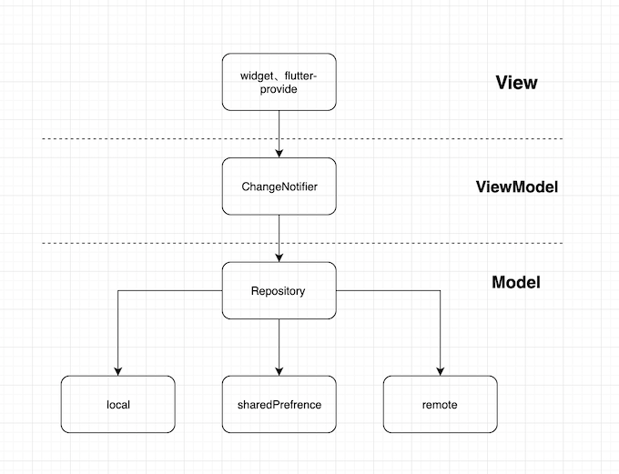

# Flutter-MVVM

Build MVVM App for Android and IOS with Flutter。

#### dependencies

- [dio](https://github.com/flutterchina/dio) : netword 
- [rxdart](https://github.com/ReactiveX/rxdart)：reactive programming
- [flutter-provide](https://github.com/google/flutter-provide)：state managing
- [dartin](https://github.com/ditclear/dartin): dependency injection

> PS：each layer connected by rx, use responsive thinking and rxdart operators for logical processing.Finally, update the view with [flutter-provide](https://github.com/google/flutter-provide).

### ScreenShot

#### LICENSE

the Apache License

